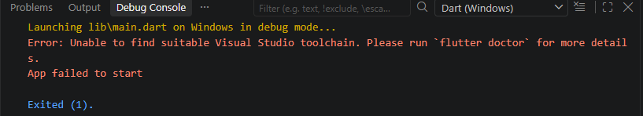
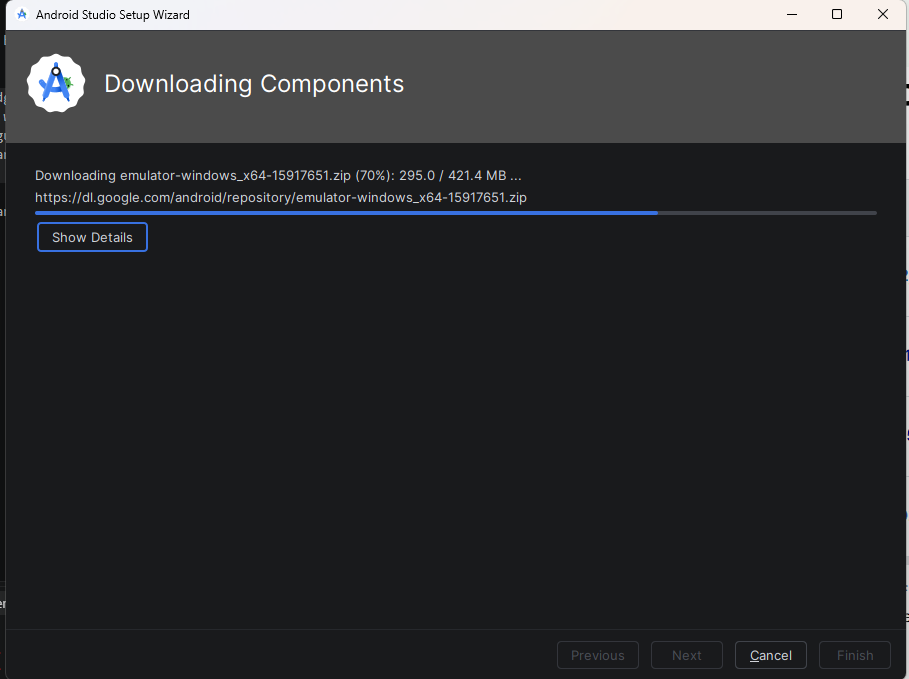
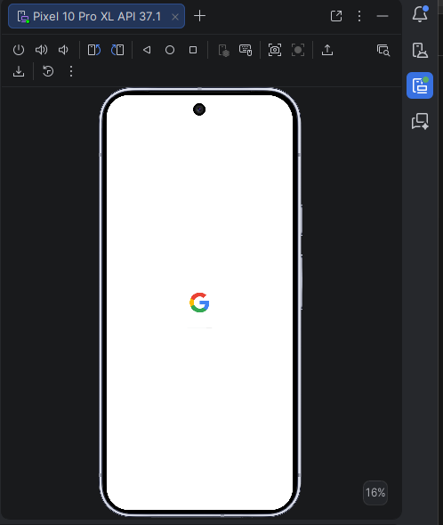
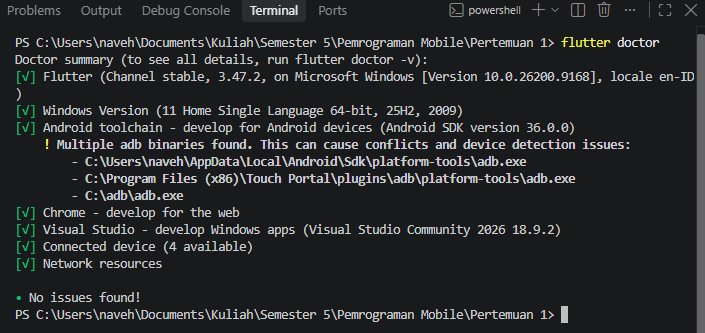

KENDALA

Saya mempunyai kendala saat ingin meng-run dan debug. Device saya tidak ada.

Akhirnya saya setup Android Studio

Serta melakukan setup untuk devicenya

Dengan flutter doctor no issue

REFLEKSI

Kapan native lebih tepat dipilih daripada cross-platform?

    Native lebih tepat dipilih ketika aplikasi memerlukan performa tinggi dan extensive interaction dengan system library yang platform spesific. 

Bagaimana perubahan state berhubungan dengan widget tree dan UI deklaratif?

    Ketika state suatu widget berubah, framework akan membangun ulang widget tree. Karena widget bersifat immutable, StatefulWidget menggunakan objek State terpisah yang memiliki masa hidup lebih panjang untuk menyimpan data yang dapat diubah.

Mengapa commit kecil dengan pesan jelas bermanfaat bagi pekerjaan tim dan portfolio?

    Agar membantu semua anggota tim memahami perubahan kode yang terjadi.

Langkah membuka
1. Flutter SDK telah terinstal dan terdeteksi. Bisa coba pastikan dengan Flutter Doctor
2. Jalankan perintah `flutter run` dan pilih target perangkat (saya memakai Pixel 10 Pro)

Hasil
