TUJUAN

    Mempelajari konsep Declarative UI di Flutter, memahami penggunaan widget dasar dan layouting, membedakan komponen Material 3 & Cupertino, dan bisa membangun UI yang responsif dengan dark mode dan aksesibilitas dasar.

FITUR UTAMA

- Responsive Layout
- Theme Toggle
- Reusable Components
- Aksesibilitas Dasar

STACK TEKNOLOGI

- Flutter
- Dart
- Material 3
- Cupertino

CARA MENJALANKAN

1. Buat project baru (flutter create responsive_dashboard)
2. Masuk ke direktori (cd responsive_dashboard)
3. Salin kode utama (dari modul) ke dalam file lib/main.dart
4. Jalankan aplikasi di emulator/device (flutter run)
5. Jalankan pengujian responsivitas (flutter test)

HASIL

    Aplikasi Academic Overview yang rapi, dan responsif. Yang keterbacaannya aman di berbagai ukuran layar, Melakukan pergantian tema dengan mulus, dan lulus widget testing dasar tanpa ada error atau warning dari flutter analyze.

HASIL PRAKTIKUM 1

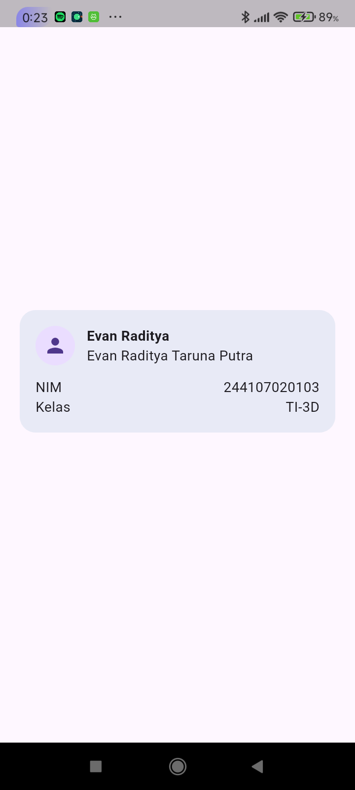

Eksperimen warm-up
1. Hapus Expanded pada baris nama, lalu amati peringatan overflow atau perilaku layout-nya; kembalikan setelah itu.

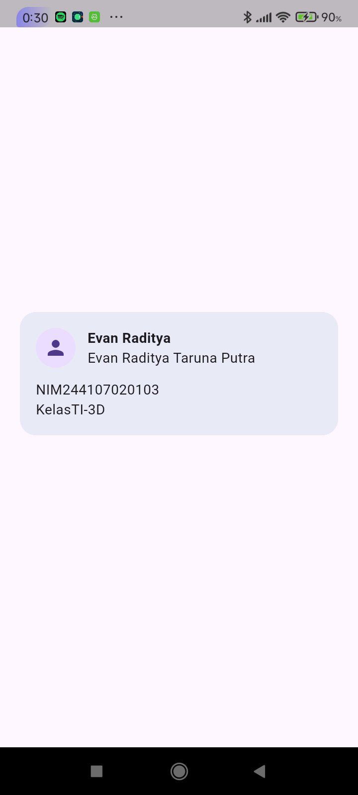

2. Ganti mainAxisSize: MainAxisSize.min menjadi nilai default dan amati perubahan tinggi kartu.

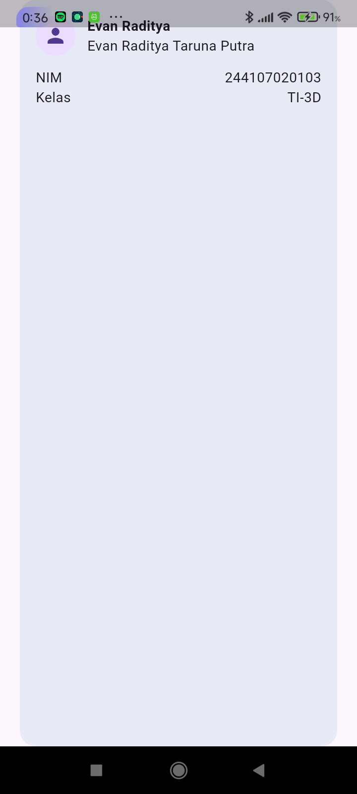

3. Tambahkan satu baris data (misal Email) menggunakan pola Row + Expanded yang sama.

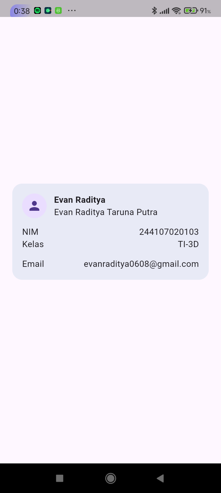

HASIL PRAKTIKUM 2

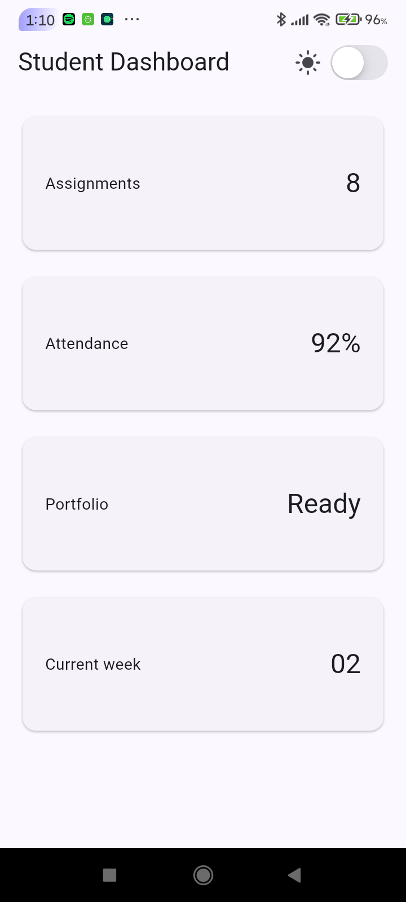

Eksperimen layout
1. Ubah breakpoint dari 700 menjadi nilai lain dan amati perubahan jumlah kolom.

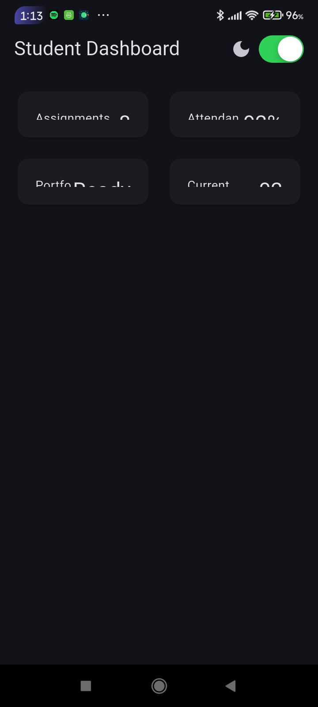

Saya ganti 300 dan terlihat menyempit sekali, serta menjadi 2 kolom

2. Ubah themeMode menjadi ThemeMode.dark, lalu kembalikan ke ThemeMode.system.

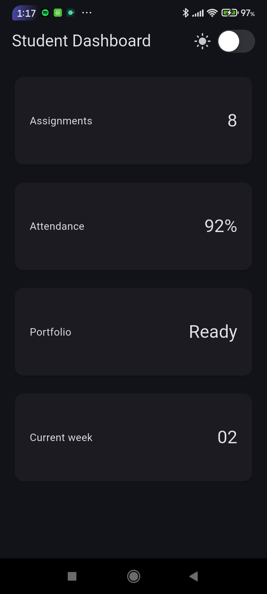

3. Uji aplikasi dengan ukuran layar emulator yang berbeda.

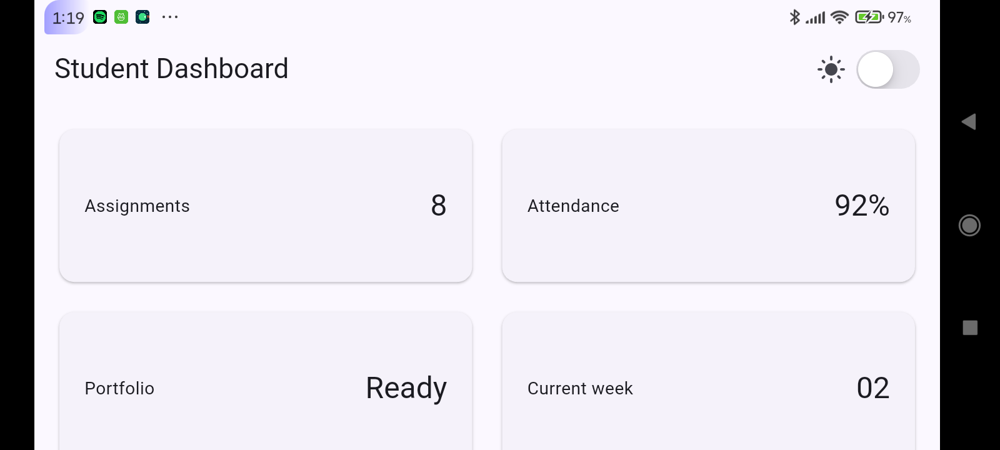

4. Tambahkan Semantics atau label yang bermakna pada elemen yang penting bagi screen reader.

TUGAS UTAMA

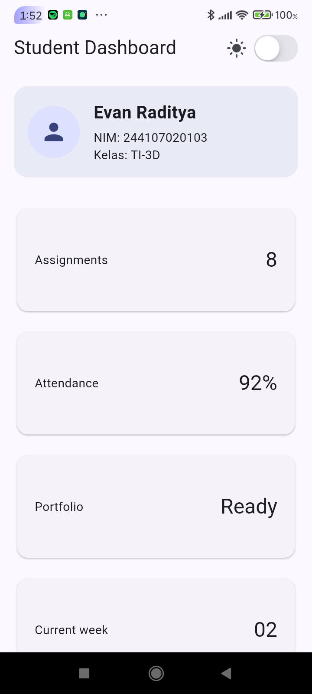

AI PROMPT CHALLENGE
1. Prompt desain.

2. Prompt penguatan konsep.

3. Verification prompt.

HASIL REFACTORING CHALLENGE

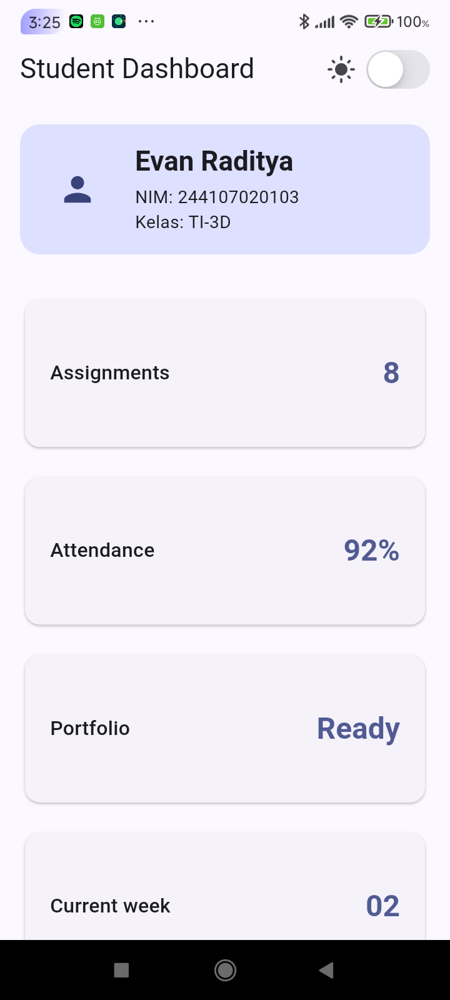

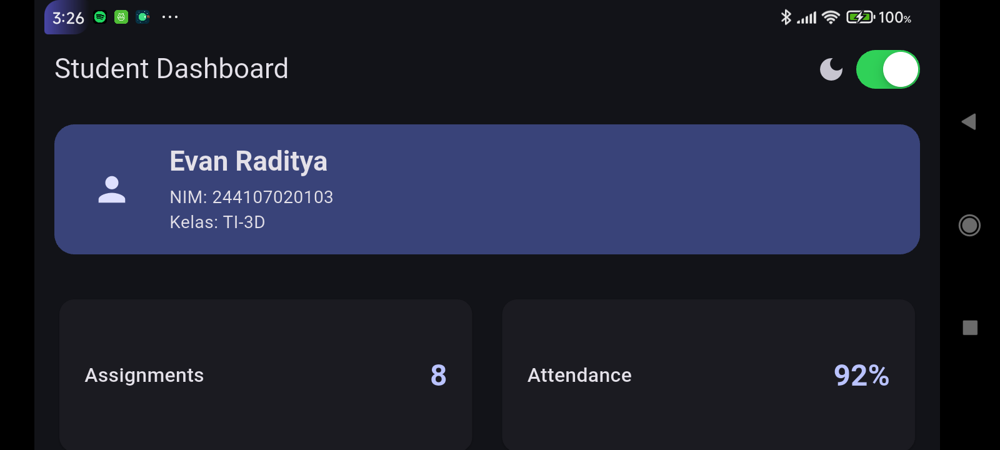

TESTING DASAR

REFLEKSI

Apa perbedaan cara berpikir imperative dan declarative saat membangun UI?

    Imperative - Berfokus pada bagaimana sesuatu dibuat langkah demi langkah dengan mengubah status UI secara manual (misal: mencari elemen lalu mengubah propertinya secara langsung)

    Declarative - Berfokus pada apa tampilan yang diinginkan berdasarkan data atau state saat ini, di mana Flutter akan otomatis merender ulang UI ketika state berubah

Kapan Expanded membantu dan kapan penggunaannya justru menghasilkan layout error?

    Membantu - Saat Anda perlu memaksa Row, Column, atau Flex mengisi sisa ruang kosong yang tersedia degnan fleksibel

    Menyebabkan Error - Saat digunakan di dalam parent widget dengan unbounded constraints seperti SingleChildScrollView horizontal, karena Flutter tidak dapat mengalkulasi batas ukuran ruang tersebut

Bagaimana breakpoint dan theme memengaruhi pengalaman pengguna?

    Breakpoint - Memastikan tata letak konten ikut ukuran layar perangkat (misalnya beralih dari 1 kolom ke 2 kolom), mencegah teks terpotong, dan agar navigasi nyaman

    Theme - Memungkinkan transisi mode terang dan gelap untuk menjaga rasio kontras visual dan agar nyaman di kondisi pencahayaan apa saja

Apa yang Anda verifikasi dari rekomendasi AI setelah tugas inti selesai?

    Menguji apakah tata letak tetap responsif pada layar sempit di bawah 600px

    Memastikan struktur kode tidak menurunkan fungsi aksesibilitas
