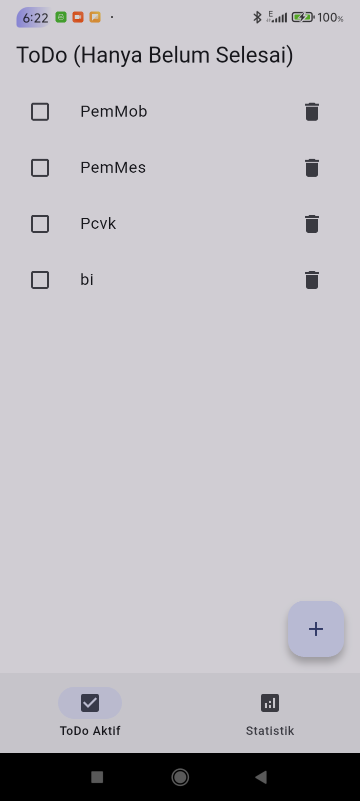
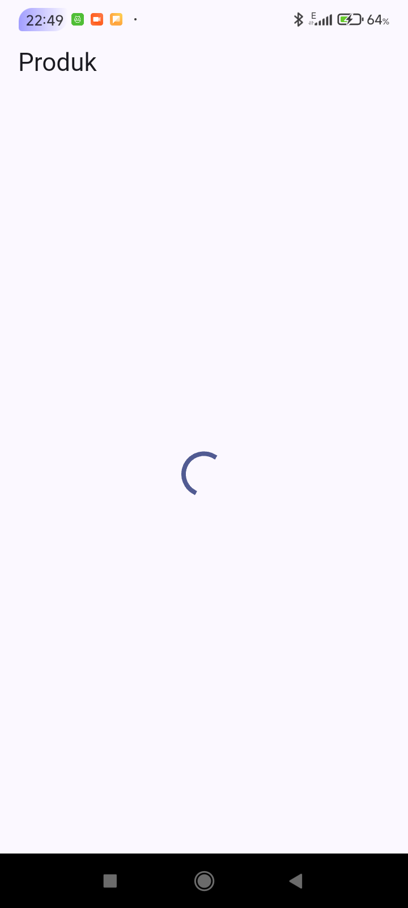
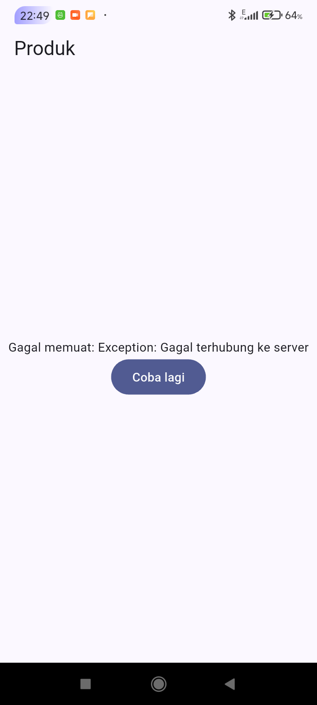
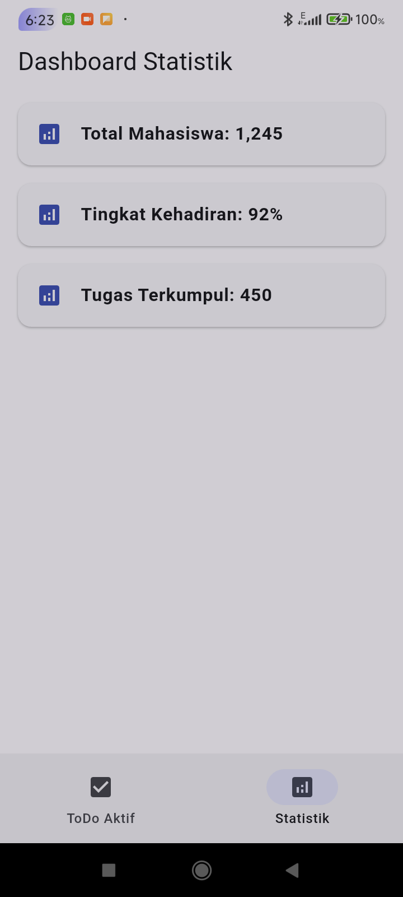

TUJUAN

Membangun aplikasi ToDo interaktif yang mengimplementasikan navigasi multi page dengan GoRouter, manajemen state terpusat yang aman dengan Riverpod, dan penanganan proses menggunakan AsyncValue.

FITUR UTAMA

- GoRouter Navigation
- State management dengan Riverpod
- AsyncValue: loading, error, success
- UI Responsif dengan Material 3

STACK TEKNOLOGI

- Flutter
- Dart
- flutter_riverpod
- go_router

CARA MENJALANKAN

1. Buka terminal dan masuk ke direktori project (cd week3_todo)
2. Unduh dan perbarui dependensi package (flutter pub get)
3. Jalankan aplikasi di emulator atau perangkat fisik (flutter run)
4. Verifikasi kualitas kode (flutter analyze)
5. Jalankan pengujian widget dan unit (flutter test)

MINI PROJECT

Aplikasi ToDo 2 halaman (Daftar Tugas & Statistik) terintegrasi. State aplikasi tetap dipertahankan saat berpindah tab melalui NavigationBar. Halaman statistik berhasil mensimulasikan pengambilan data asinkron dengan indikator loading awal, penanganan error 30% dengan tombol retry, dan menampilkan data secara sukses.

AI PROMPT CHALLENGE

1. Prompt AI untuk membuat StatsPage dengan AsyncNotifier dan Unit Test yang menangani loading, error, dan success.

2. AI Verification Checklist:
- State diubah secara immutable? Ya, data dikembalikan sebagai list baru
- ref.watch di build, ref.read di callback? Ya
- Ketiga state AsyncValue ditangani? Ya, dieksekusi secara eksplisit dengan .when()
- Provider dideklarasikan dengan tipe eksplisit? Ya
- Memakai API Riverpod terbaru? Ya (AsyncNotifier dan ConsumerWidget)
- Lolos analyze dan test? Ya

3. Bagian hasil AI yang diperbaiki:
- Menyesuaikan penamaan package import pada file unit test agar sesuai dengan nama asli project di pubspec.yaml.

HASIL REFACTORING CHALLENGE

1. Ekstrak TodoTile menjadi widget mandiri untuk memisahkan logika UI per item.
2. Implementasi uncompletedTodoProvider untuk menyaring tugas secara deklaratif.
3. Integrasi aplikasi dengan GoRouter menggunakan ShellRoute.

HASIL TEST

REFLEKSI

Kapan setState masih cukup, dan kapan state harus naik ke Riverpod?

  setState cukup untuk state UI lokal yang bersifat sementara (seperti mengubah state switch, buka-tutup dropdown, atau text input). State harus pindah ke Riverpod jika data tersebut adalah inti bisnis (seperti daftar tugas), dibagikan di banyak halaman, atau melibatkan proses asinkron yang rumit.

Apa perbedaan context.go dan context.push, dan kapan masing-masing tepat digunakan?

  context.go mengganti rute secara absolut, sangat cocok digunakan untuk navigasi utama yang seperti pindah tab pada BottomNavigationBar. context.push menumpuk halaman baru di atas halaman saat ini, cocok untuk menavigasi pengguna dari daftar ke halaman detail sehingga bisa kembali.

Bagaimana AsyncValue mencegah bug dibanding tiga boolean terpisah?

  Menggunakan 3 boolean (isLoading, hasError, isSuccess) secara terpisah rawan memunculkan state ganda yang tidak valid. AsyncValue menyatukan ketiga kondisi tersebut menjadi satu tipe dimana hanya satu status yang bisa aktif pada satu waktu, memastikan UI selalu dirender secara konsisten.

Bagian mana dari hasil AI yang Anda perbaiki, dan mengapa?

  Memperbaiki Widget Test hasil instruksi awal dengan menambahkan await tester.pumpAndSettle() setelah menekan tombol navigasi atau pop-up. Hal ini dilakukan karena framework dan navigasi modern memiliki waktu animasi transisi yang akan menyebabkan test error jika hanya menggunakan tester.pump() standar.